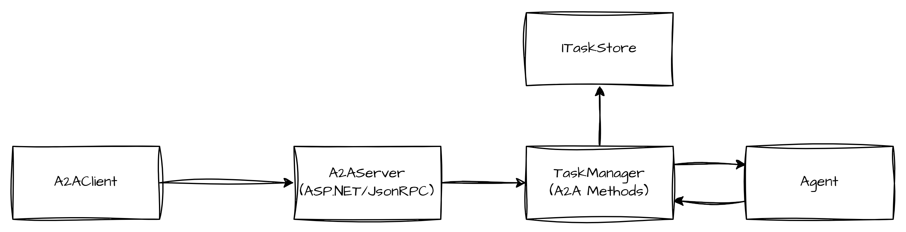

# SharpA2A: A .NET implementation of the Google A2A protocol
Interact with agents using the A2A protocol in .NET applications. This library is designed to be used with ASP.NET Core applications and provides a simple way to add A2A support to your agents.

## Status

This library is in early development and is not yet ready for production use. The following shows the current status of the library:

- Server
    - task/send  (push notification set is not yet implemented)
    - task/sendsubscribe
    - task/get  (history length is not yet implemented)
    - task/pushnotification/set  (Client notifications are not yet sent)
    - task/pushnotification/get
- Client
    - task/send
    - task/get
    - task/sendsubscribe (Not yet implemented)
    - task/pushnotification/set  (Client notifications cannot yet be received)
    - task/pushnotification/get

## Overview



## Library: a2a.AspNetCore
This library adds the MapA2A extension method that allows you to add A2A support to an Agent hosted at the specified path.

```c#
var echoAgent = new EchoAgent();
var echoTaskManager = new TaskManager();
echoAgent.Attach(echoTaskManager);
app.MapA2A(echoTaskManager,"/echo");
```

## Library: SharpA2A.Core
This library contains the core A2A protocol implementation. It includes the following classes:
- `A2AClient`: Used for making A2A requests to an agent.
- `TaskManager`: Provides standardized support for managing tasks and task execution.
- `ITaskStore`: An interface for abstracting the storage of tasks. `InMemoryTaskStore` is a simple in-memory implementation.

## Library: DomFactory
This library contains helper classes for support deserialization and serialization of A2A messages and JsonRPC envelopes. In theory this can be done with JsonSerializer, but this library makes the process easier to debug and doesn't require an reflection or code generation.

## Agent Integration Example

Each agent instance should be given its own `TaskManager` instance. The `TaskManager` is responsible for managing the tasks and their execution. It is an implementation decision as to whether a single agent instance processes many tasks or whether an agent instance is created for each task.

```c#
using SharpA2A.Core;

public class EchoAgent
{
    private TaskManager? _TaskManager;

    public void Attach(TaskManager taskManager)
    {
        _TaskManager = taskManager;
        taskManager.OnTaskCreated = ExecuteAgentTask;
        taskManager.OnTaskUpdated = ExecuteAgentTask;
    }

    public async Task ExecuteAgentTask(AgentTask task) {
        if  (_TaskManager == null) {
            throw new Exception("TaskManager is not attached.");
        }
        // Set Status to working
        await _TaskManager.UpdateStatusAsync(task.Id, TaskState.Working);

        var message = task.History!.Last().Parts.First().AsTextPart().Text;
        var artifact = new Artifact() {
            Parts = [new TextPart() {
                Text = $"Echo: {message}"
            }]
        };
        await _TaskManager.ReturnArtifactAsync(new TaskIdParams() {Id = task.Id}, artifact);
        await _TaskManager.UpdateStatusAsync(task.Id, TaskState.Completed, final: true);
    }
}
```